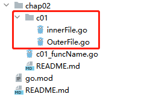

## 变量类型定义

```go
// 变量基本定义
func m1() {
// 完整定义一个变量
var v string = "test"
fmt.Printf("参数值：%v, 参数类型：%T\n", v, v)

// 省略类型定义变量，go将根据初始值自动推算类型
var v2 = "test"
fmt.Printf("参数值：%v, 参数类型：%T\n", v2, v2)

// 省略初始值，go将自动给一个零值，例如数值类型是0，字符串类型是""，map等对象类型是nil
// 不过在go中即使是零值，也是可以直接参与运算的，因此不用担心空指针问题
var v3 int
var v4 string
var v5 map[string]string
fmt.Println(v3, v4, v5)

// 多变量定义
var a, b, c int
fmt.Println(a, b, c)

// 多变量定义，省略类型；Go将根据初始值自动推算变量类型
var e, f, g = 1, "test", true
fmt.Println(e, f, g)

// 简短变量声明，也就是声明变量并赋初始值
v6 := "test"
v6 = "test2" //通过`:=`声明的变量不可再用`:=`，也就是此形式对于同一变量只能用一次
fmt.Println(v6)
}
```

### 指针

```go
package main

// 指针，拿到一个变量的指针：`&变量名`；
// 拿到一个指针变量的实际值：`*变量名`；
// 定义一个指针类型变量：`变量名 *类型`
func m2() {
	a, b := 1, 1

	c := make(map[string]string)
	c["1"] = "test1"
	c["2"] = "test2"

	swap(&a, b, c)
	fmt.Printf("修改值：a=%v, b=%v, c=%v\n", a, b, c)
}

func swap(a *int, b int, c map[string]string) {
	fmt.Printf("原始值：a=%v, b=%v, c=%v\n", *a, b, c)
	*a = 10
	b = 10
	c["3"] = "test3"
}

```

注意：在Go中并没有像Java那样有基础类型的包装类型（int - Integer）；
因此在Go中对于基础类型变量想要想要实现引用传递（通过外部函数影响原有参数内容），可以传递参数的指针来实现。

这里的指针，就是参数的内存地址。

> 扩展

同样，除了基础数据类型，Go还有类似Map、数组等数据类型，这些数据类型作为参数传递，则是直接会影响原有数据内容的（作为引用对象类型）。

## Go包可见性（命名规则）

Go语言通过函数、变量**首字母的大小写来限定它在包外的可见性**。也就是在Java中public和private的区别。

> 函数定义

例如在`innerFile.go`文件中定义：

```go
package c01

func innerM1() {
	// 此函数只能在本文件内部调用
}

func InnerM2() {
	// 此函数可以在外部文件中使用import导入c01包，并使用c01.InnerM2()的方式调用此函数
}
```

> 变量定义

变量定义和函数的定义同理，关键点还在于变量首字母是否大写，例如：

```go
package c01

type innerParam struct { //此结构体（对象）不能被外部调用，里面的所有变量当然也不可被调用
	A int
	B string
}

type OuterParam struct { //此结构体（对象）可被外部访问
	A int    //此参数是首字母大写，可以被外部访问，通过OuterParam.A访问
	b string //此参数首字母小写，不可被外部访问
}

var (
	a int    //此变量首字母小写不可被外部访问
	B string //此变量首字母大写可被外部访问
)

const c int = 1 //此变量首字母小写不可被外部访问
```

### 注意事项

> 1.包可见性，都是针对`package`维度

因为每个go文件开头必须定义所属`package`，因此go认为`package`相同的文件就是在一个包内，
也就是`package`相同的文件被视为变量、函数共享的。

那么上述提到的包的可见性都是针对不同的`package`文件间的函数、变量访问规则

> 2.强制一个文件夹下只能有相同`package`的go文件



如上在c01文件夹下的所有go文件都必须定义相同的`package`，Go认为此文件夹下的文件是同一个包的；
同一个包内的函数、变量共享访问；不同`package`的go文件通过函数、变量首字母是否大写限定包外可见性。

> 3.不以文件首字母大小写限定可见性

如上图，即使一个文件夹下面（package）有首字母大写和小写的文件，但并不影响其中函数、变量的可见性规则

